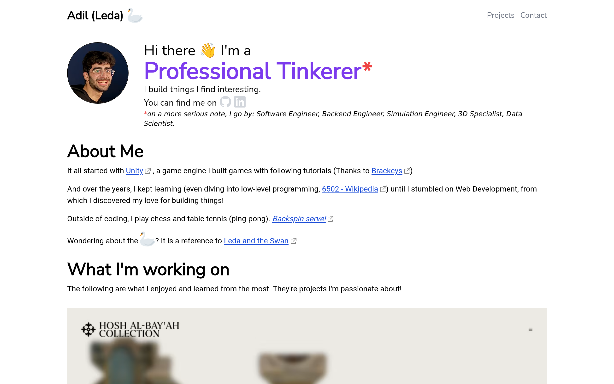

<h1 align="center">
     
    
    <a href="https://leda.dev">Personal Portfolio</a>
     
</h1>

My current personal portfolio, built with <a href="https://astro.build" target="_blank" rel="noreferrer noopener" >Astro</a> and <a href="https://mdxjs.com" target="_blank" rel="noreferrer noopener">MDX</a>

## Writing a Project Details Page

Information that must be supplied in frontmatter:

- Project name
- Project summary
- Project cover
- Project description
- Project technologies (https://github.com/simple-icons/simple-icons/blob/master/slugs.md)
- Project source
- Project demo
- Draft (boolean)
- Featured (boolean)
- Order (order on homepage and projects page)

## Related Repositories

- [Contact Form Webserver](https://github.com/LedaThemis/contact-form-webserver)
